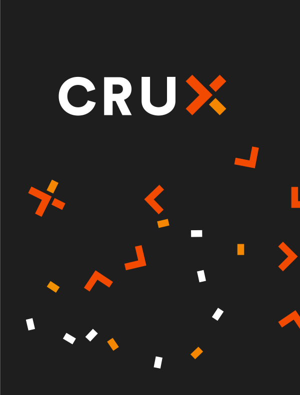

# AI: Better code for better digital experiences

2023-09-20

Stuart Harris

Founder & Chief Scientist

Red Badger

---

<!--
paginate: true
footer: "AI: Better code for better digital experiences"
-->

 _low_-code,
_no_-code, _ai-gen_-code

 _Rust_ and
_WebAssembly_

 _Crux_ —
experimental, open source tooling for building _headless_ apps

---


# Stu

- Software engineer
- Founder of Red Badger

[@stuartharris](https://twitter.com/stuartharris)

## 

---


<span class="morph" style="--morph-name:title;">_low_-code, _no_-code,
_ai-gen_-code</span>

 _Rust_ and
_WebAssembly_

 _Crux_ —
experimental, open source tooling for building _headless_ apps

---


# <span class="morph" style="--morph-name:title;">_Code_ — <br/>_low_-code, _no_-code, _ai-gen_-code</span>

<style scoped>section figure { margin-right: 100px !important; }</style>


---

#  Can you express it in words?

> If you _can't describe it_, unambiguously, to a stranger, then low-code will
> not help you.

> If you _can write it down_ in words, then it's easy to write it in code.

> AI can help you write it in words. And in code.

---

#  Demo


---

 _low_-code,
_no_-code, _ai-gen_-code


<span class="morph" style="--morph-name:title;">_Rust_ and _WebAssembly_</span>

 _Crux_ —
experimental, open source tooling for building _headless_ apps

---


# <span class="morph" style="--morph-name:title;">_Rust_ and _WebAssembly_</span>


---

#  Better Tools and Better Architecture

- <span class="morph" style="--morph-name:rust;">**Rust** is a
  _revolution_</span>

  everyone can now build reliable, high quality software in almost any space
  — perfect for multi-platform app development

- **WebAssembly** is a _revolution_

  fast and portable — great for building apps in the languages we love

---

#  <span class="morph" style="--morph-name:rust;">**Rust** is a _revolution_</span>

<style scoped>section figure { margin-right: 100px !important; }</style>


- _Quality_ — build software that works
- _Portability_ — from embedded to cloud
- _Sustainability_ — build software that lasts, and be greener
- _Security_ — be secure
- _Cost, Speed_ — be faster overall, and cheaper to run
- _Control, Risk, Compliance_ — be in control, reduce risk, and operate safely
- _Innovation, Talent, Culture_ — innovate, attract and retain talent, and build
  a culture of engineering excellence

---

#  Better Tools and Better Architecture

- <span class="morph" style="--morph-name:rust;">**Rust** is a
  _revolution_</span>

  everyone can now build reliable, high quality software in almost any space
  — perfect for multi-platform app development

- <span class="morph" style="--morph-name:wasm;">**WebAssembly** is a
  _revolution_</span>

  fast and portable — great for building apps in the languages we love

---

#  <span class="morph" style="--morph-name:wasm;">**WebAssembly** is a _revolution_</span>


WebAssembly Component Model

WIT

https://cosmonic.com/blog/engineering/gap-bridging-with-wasifills

---

<iframe height="705" src="https://www.youtube.com/embed/tAACYA1Mwv4" title="Keynote: What is a Component (and Why)? - Luke Wagner, Distinguished Engineer, Fastly" frameborder="0" allow="accelerometer; autoplay; clipboard-write; encrypted-media; gyroscope; picture-in-picture; web-share" allowfullscreen></iframe>

---


---


---

#  Crux


- Shared _behaviour_

- in _Rust_ 

- Platform _native_ UX

---

#  Building a multi-platform app (don’t @ me!)

<style scoped>
table th {
    width: 14%;
}
</style>

|             | Platform Native | Kotlin MM | React Native | Capacitor Ionic | Flutter | Crux |
| ----------- | :-------------: | :-------: | :----------: | :-------------: | :-----: | :--: |
| Native UX   |       ✅        |    ✅     |     😐️      |       ❌        |   ❌    |  ✅  |
| Web?        |       ❌        |    😐️    |     😐️      |       ✅        |   ✅    |  ✅  |
| Development |       😐️       |    ✅     |     😐️      |       ✅        |   ✅    |  ✅  |
| Testing     |       😐️       |    😐️    |      🤯      |       🤯        |   😐️   |  🤩  |
| Maintenance |       😐️       |    ✅     |      😡      |       😡        |   ✅    |  ✅  |
| Effort      |       3x        |    2x     |      2x      |      1.5x       |  1.4x   | 1.4x |

---


---

#  What does testing look like?


---

#  What does a test look like?

```rust
#[cfg(test)]
mod test {
    use super::*;
    use crux_core::testing::AppTester;

    #[test]
    fn increments_count() {
        let app = AppTester::<App, _>::default();
        let mut model = Model::default();

        let update = app.update(Event::Increment, &mut model);

        // Check the app asked us to `Render`
        assert_effect!(update, Effect::Render(_));

        // Check view model is correct
        let actual_view = app.view(&model).count;
        let expected_view = "Count is: 1";
        assert_eq!(actual_view, expected_view);
    }
}
```

---

#  17ms

## 

---



#  The crux of Crux

github.com/redbadger/_crux_

- _headless_, multi-platform, composable apps with shared _behaviour_
- better _testability_
- higher _quality_ apps
- more _joy_ from better tools

---

# Thank you! 

<style scoped>section figure { margin-right: 100px !important; }</style>


[@stuartharris](https://twitter.com/stuartharris)

<br/>

[Slides](https://github.com/StuartHarris/slides/blob/main/badger_event_2023_09_20/slides.pdf)

[Crux Book](https://redbadger.github.io/crux/),
[Crux Github](https://github.com/redbadger/crux),
[Crux Docs](https://docs.rs/crux_core/latest/crux_core/),
[Crux Website](https://red-badger.com/crux)

[Rust Nation 2023 Talk](https://www.youtube.com/watch?v=cWCZms92-1g&t=5s)
