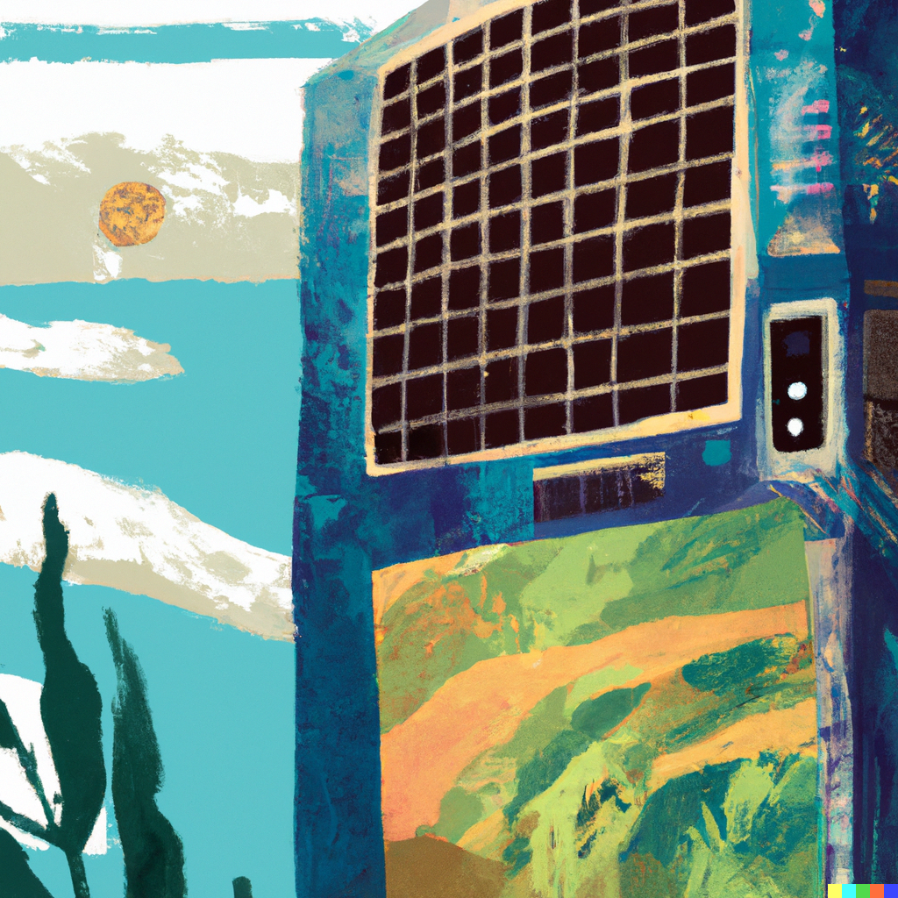
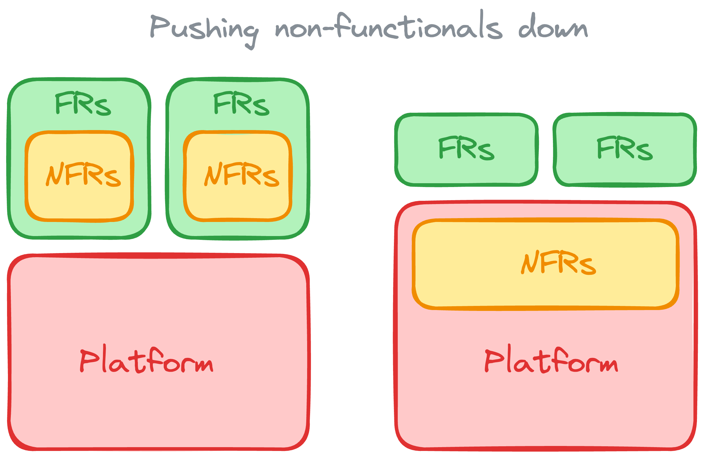

[1]: https://icongr.am/material/numeric-1-circle.svg?color=666666
[2]: https://icongr.am/material/numeric-2-circle.svg?color=666666
[3]: https://icongr.am/material/numeric-3-circle.svg?color=666666
[4]: https://icongr.am/material/numeric-4-circle.svg?color=666666
[5]: https://icongr.am/material/numeric-5-circle.svg?color=666666
[6]: https://icongr.am/material/numeric-6-circle.svg?color=666666
[1a]: https://icongr.am/material/numeric-1-circle.svg?color=ff9900
[2a]: https://icongr.am/material/numeric-2-circle.svg?color=ff9900
[3a]: https://icongr.am/material/numeric-3-circle.svg?color=ff9900
[4a]: https://icongr.am/material/numeric-4-circle.svg?color=ff9900
[5a]: https://icongr.am/material/numeric-5-circle.svg?color=ff9900
[6a]: https://icongr.am/material/numeric-6-circle.svg?color=ff9900

# Mapping the Future of Sustainable Digital Products

2023-11-28

Stuart Harris

Founder & Chief Scientist

Red Badger

---

<!--
paginate: true
footer: "Mapping the Future of Sustainable Digital Products"
-->

![1][1] Rust

![2][2] WebAssembly

![3][3] Next-gen platforms

---

# Stu

- Software engineer
- Founder of Red Badger

> [@stuartharris](https://twitter.com/stuartharris)

## 

---

# 6 principles of sustainable software engineering

1. _Carbon efficiency_ — minimize the amount of carbon emitted per unit of work
2. _Energy efficiency_ — the more you utilize a computer, the more efficient it
   becomes at converting electricity to useful computing operations
3. _Carbon awareness_ — Shifting demand to times when carbon intensity is low
4. _Hardware efficiency_ — reduce embodied carbon by extending the life of
   hardware
5. _Measurement_ — measure the carbon footprint of your software
6. _Climate commitments_ — net zero (abate/eliminate) vs. carbon neutral
   (offset)

> [25 minute overview](https://learn.microsoft.com/en-us/training/modules/sustainable-software-engineering-overview/)

---

> [Green Software Foundation](https://greensoftware.foundation/)

---

# Sustainable Software Engineering

> Find as many "Carbon Proxies" as you can

- Time-to-interactive and Page weight
- Average server response time
- Cost of your services
- The utilisation of your servers

> [Sustainable Software Engineering overview](https://learn.microsoft.com/en-gb/training/modules/sustainable-software-engineering-overview),
> [How to measure and reduce the carbon footprint of your application](https://www.microsoft.com/en-gb/industry/blog/technetuk/2021/10/12/how-to-measure-and-reduce-the-carbon-footprint-of-your-application/)

---

## Three revolutions

![1][1a] **Rust** is a
_revolution_ in sustainable software engineering

![2][2] WebAssembly

![3][3] Next-gen platforms

---

# ![1 h:150 w:150][1a] **Rust** is a _revolution_ in sustainable software engineering

---

> [Why Rust in production?](https://corrode.dev/why-rust/),
> [Sustainability with Rust](https://aws.amazon.com/blogs/opensource/sustainability-with-rust/)

---

> [Why Rust in production?](https://corrode.dev/why-rust/)

---

> [Why Rust in production?](https://corrode.dev/why-rust/)

---

## Three revolutions

![1][1] Rust

![2][2a] WebAssembly

![3][3] Next-gen platforms

---

# ![2 h:150 w:150][2a] **WebAssembly** is a _revolution_

---

# ![2 h:150 w:150][2a] The **WebAssembly** _Component Model_

---

<iframe height="705" src="https://www.youtube.com/embed/tAACYA1Mwv4" title="Keynote: What is a Component (and Why)? - Luke Wagner, Distinguished Engineer, Fastly" frameborder="0" allow="accelerometer; autoplay; clipboard-write; encrypted-media; gyroscope; picture-in-picture; web-share" allowfullscreen></iframe>

---

## Three revolutions

![1][1] Rust

![2][2] WebAssembly

![3][3a] Next-gen
platforms

---

# ![3 h:150 w:150][3a] **Next-gen platforms** are a _revolution_

---

---

# **Cosmonic** and _wasmCloud_

> "The next-gen Kubernetes"

> [https://cosmonic.com/](https://cosmonic.com/),
> [https://wasmcloud.com/](https://wasmcloud.com/)

# **Fermyon** and _Spin_

> "The next-gen AWS Lambda"

> [https://www.fermyon.com/](https://www.fermyon.com/),
> [https://www.fermyon.com/spin](https://www.fermyon.com/spin),
> [https://www.fermyon.com/cloud](https://www.fermyon.com/cloud)

---

## Three revolutions

![1][1a] Rust

![2][2a] WebAssembly

![3][3a] Next-gen platforms

---

# Thank you!

[@stuartharris](https://twitter.com/stuartharris)

