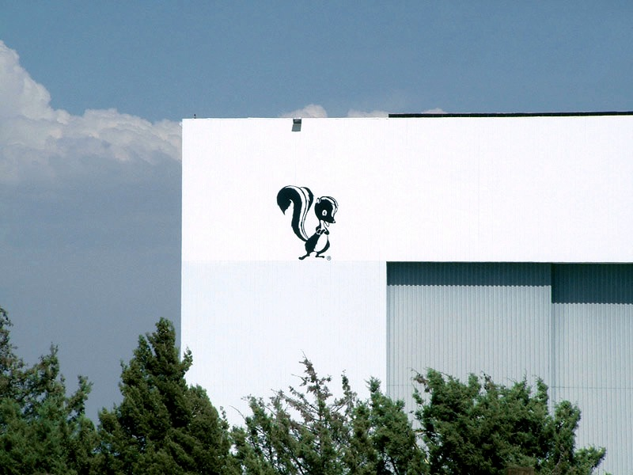
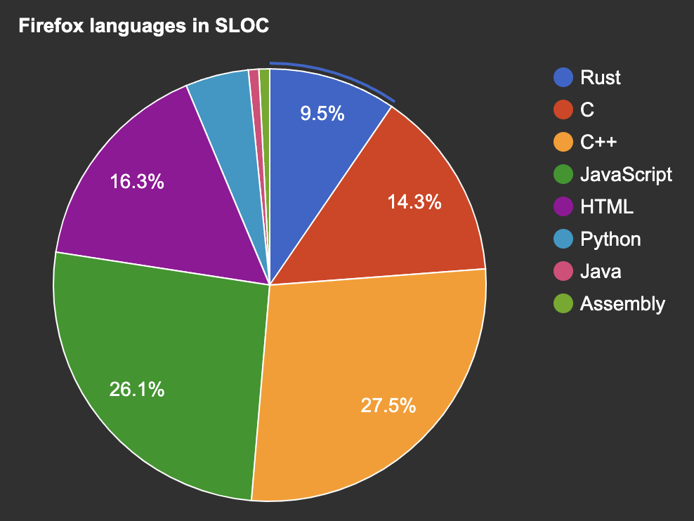

[1]: https://icongr.am/material/numeric-1-circle.svg?color=666666
[2]: https://icongr.am/material/numeric-2-circle.svg?color=666666
[3]: https://icongr.am/material/numeric-3-circle.svg?color=666666
[4]: https://icongr.am/material/numeric-4-circle.svg?color=666666
[5]: https://icongr.am/material/numeric-5-circle.svg?color=666666
[6]: https://icongr.am/material/numeric-6-circle.svg?color=666666
[1a]: https://icongr.am/material/numeric-1-circle.svg?color=ff9900
[2a]: https://icongr.am/material/numeric-2-circle.svg?color=ff9900
[3a]: https://icongr.am/material/numeric-3-circle.svg?color=ff9900
[4a]: https://icongr.am/material/numeric-4-circle.svg?color=ff9900
[5a]: https://icongr.am/material/numeric-5-circle.svg?color=ff9900
[6a]: https://icongr.am/material/numeric-6-circle.svg?color=ff9900


# Rust in the Enterprise

2023-09-23

Stuart Harris and Viktor Charypar

---

<!--
paginate: true
footer: "Rust in the Enterprise"
-->

![1][1] How does Rust help solve the problems that Enterprises care about?

![2][2] Where does the resistance to adopting Rust come from?

![3][3] How do we go about introducing Rust into an Enterprise?

![4][4] Beer and Pizza

![5][5] Crux — how Rust can help enterprises build multi-platform apps

---


# Stu

- Software engineer
- Founder of Red Badger


---


# Viktor

- Software engineer
- Tech Director at Red Badger


---

# What do enterprises care about?

![1][1a] <span class="morph" style="--morph-name:title;">_Quality_ software that
works</span>

![2][2] _Sustainability_ — green software that lasts

![3][3] _Security_ and reputational damage

![4][4] _Cost_ and speed of delivery

![5][5] _Control, Risk, Compliance_ operate safely in regulated environments

![6][6] _Innovation, Talent, Culture_ be a destination employer

---

![1 w:256 h:256][1a]

# <span class="morph" style="--morph-name:title;">_Quality_ software that works</span>

## ... and _delights_ our users

- easy to use, accessible for everyone, fast and reliable
- maintainable, extensible and _testable_

<style scoped>section figure { margin-right: 100px !important; }</style>


---

# ![1][1a] Shifting left

## Remove the long tail of bugs that are expensive to fix

> "Rust is the language where you have the hangover first!"

## 

https://deepsource.com/blog/exponential-cost-of-fixing-bugs

---

# What do enterprises care about?

![1][1] _Quality_ software that works

![2][2a] <span class="morph" style="--morph-name:title;">_Sustainability_ —
green software that lasts</span>

![3][3] _Security_ and reputational damage

![4][4] _Cost_ and speed of delivery

![5][5] _Control, Risk, Compliance_ operate safely in regulated environments

![6][6] _Innovation, Talent, Culture_ be a destination employer

---

![2 h:256 w:256][2a]

# <span class="morph" style="--morph-name:title;">_Sustainability_ — green software that lasts</span>

## ... and is easy to _maintain_ and extend

> Must be easy to understand, test, deploy, change

<style scoped>section figure { margin-right: 100px !important; }</style>


---

# ![2][2a] Where does the effort go?

> "Free up your teams to work on the most important problems — those that are
> _unique_ to your business"

- Rust's guardrails prevent us wasting time on bugs
- Rust's toolchain is the best there is
  - removes bike-shedding
  - reduces yak-shaving
- A large codebase won't descend into chaos
- "It just works"™
  - no long tail — means you can leave it alone

<style scoped>section figure { margin-right: 100px !important; }</style>


---

# ![2][2a] Sustainable Software Engineering

> "Everyone has a part to play." "Sustainability is enough, all by itself, to
> justify our work."

- Find as many "Carbon Proxies" as you can, e.g.
  - Time-to-interactive and Page weight
  - Average server response time
  - Cost of your services
  - The utilisation of your servers


[sustainability with rust](https://aws.amazon.com/blogs/opensource/sustainability-with-rust/)
[sustainable software engineering overview](https://learn.microsoft.com/en-gb/training/modules/sustainable-software-engineering-overview)
[how to measure and reduce the carbon footprint of your application](https://www.microsoft.com/en-gb/industry/blog/technetuk/2021/10/12/how-to-measure-and-reduce-the-carbon-footprint-of-your-application/)

---

# What do enterprises care about?

![1][1] _Quality_ software that works

![2][2] _Sustainability_ — green software that lasts

![3][3a] <span class="morph" style="--morph-name:title;">_Security_ and
reputational damage</span>

![4][4] _Cost_ and speed of delivery

![5][5] _Control, Risk, Compliance_ operate safely in regulated environments

![6][6] _Innovation, Talent, Culture_ be a destination employer

---

![3 h:256 w:256][3a]

# <span class="morph" style="--morph-name:title;">_Security_ and reputational damage</span>

## Secure by _design_

> Must be easy to _reason_ about, solid and _reliable_, built on an _open_ and
> _secure_ foundation

<style scoped>section figure { margin-right: 100px !important; }</style>


---

# What do enterprises care about?

![1][1] _Quality_ software that works

![2][2] _Sustainability_ — green software that lasts

![3][3] _Security_ and reputational damage

![4][4a] <span class="morph" style="--morph-name:title;">_Cost_ and speed of
delivery</span>

![5][5] _Control, Risk, Compliance_ operate safely in regulated environments

![6][6] _Innovation, Talent, Culture_ be a destination employer

---

![4 h:256 w:256][4a]

# <span class="morph" style="--morph-name:title;">_Cost_ and speed of delivery</span>

> We think that, overall, Rust speeds up development and reduces costs

---

# ![4][4a] There are rumours...

- Rust takes more than 6 months to learn – Debunked! 😇
- The Rust compiler is not as fast as people would like – Confirmed! 😅
- Unsafe code and interop are always the biggest challenges – Debunked! 😌
- Rust has amazing compiler error messages – Confirmed! 😍
- Rust code is high quality – Confirmed! 🤩

from over 1,000 Google developers

https://opensource.googleblog.com/2023/06/rust-fact-vs-fiction-5-insights-from-googles-rust-journey-2022.html

---


---

# What do enterprises care about?

![1][1] _Quality_ software that works

![2][2] _Sustainability_ — green software that lasts

![3][3] _Security_ and reputational damage

![4][4] _Cost_ and speed of delivery

![5][5a] <span class="morph" style="--morph-name:title;">_Control, Risk,
Compliance_ — operate safely in a regulated environment</span>

![6][6] _Innovation, Talent, Culture_ be a destination employer

---

![5 h:256 w:256][5a]

# <span class="morph" style="--morph-name:title;">_Control, Risk, Compliance_ — operate safely in a regulated environment</span>

- trusted and open source
- safe from memory related bugs
- safe from data races and concurrency bugs
- easy to _test_ and _maintain_ — good for regulated industries

<style scoped>section figure { margin-right: 100px !important; }</style>


---

# ![5][5a] Rust and WebAssembly

- Rust and Wasm are a perfect match
- Wasm is becoming a game-changer for cloud native
- The sandboxed execution environment is a great fit for enterprise

<style scoped>section figure { margin-right: 100px !important; }</style>


---

# ![5][5a] <span class="morph" style="--morph-name:wasm;">**WebAssembly** is a _revolution_</span>


WebAssembly Component Model

WIT

https://cosmonic.com/blog/engineering/gap-bridging-with-wasifills

---

<iframe height="705" src="https://www.youtube.com/embed/tAACYA1Mwv4" title="Keynote: What is a Component (and Why)? - Luke Wagner, Distinguished Engineer, Fastly" frameborder="0" allow="accelerometer; autoplay; clipboard-write; encrypted-media; gyroscope; picture-in-picture; web-share" allowfullscreen></iframe>

---


---


---

# What do enterprises care about?

![1][1] _Quality_ software that works

![2][2] _Sustainability_ — green software that lasts

![3][3] _Security_ and reputational damage

![4][4] _Cost_ and speed of delivery

![5][5] _Control, Risk, Compliance_ operate safely in regulated environments

![6][6a] <span class="morph" style="--morph-name:title;">_Innovation, Talent,
Culture_ be a destination employer</span>

---

![6 h:256 w:256][6a]

# <span class="morph" style="--morph-name:title;">_Innovation, Talent, Culture_ be a destination employer</span>

> "Managers need to know that their hard-won employees are gainfully employed
> and are not frustrated, bored, or flight risks"

<style scoped>section figure { margin-right: 100px !important; }</style>


---

# ![6][6a] Innovation, Talent, Culture

- attract and retain talent — become a "destination"
- build a culture of engineering excellence
- Rust helps you become a better software engineer
- "Most loved/desired" on Stack Overflow for 8 years in a row

---

# Where does the resistance come from?

- **Risk** — "We don't want to be the first to do this"
- **Cost** — "We don't have the budget"
- **Speed** — "We don't have the time"
- **Culture** — "We don't have the talent"

> This is all FEAR talking — FUD!

<style scoped>section figure { margin-right: 100px !important; }</style>


---

# Pincer movement!

- **Top down** — "We need to do this"
- **Bottom up** — "We want to do this"

<style scoped>section figure { margin-right: 100px !important; }</style>


---

# How do we get there?

## Top down

- Talk to the CIO. Find a buddy to help you
- Find the open source owner (OSPO)
- Find a champion (and a project goal)
  - Might not be a technology champion
  - Would be great to have a product sponsor
- Run a 2-horse race

<style scoped>section figure { margin-right: 100px !important; }</style>


---

# Skunk Works

<!-- prettier-ignore -->
> a group within an organization given a high degree of autonomy and unhampered by bureaucracy, with the task of working on advanced or secret projects



---

# Now is the time

> “We don’t want to be first, but we can’t be third!”

But if you’re not starting now, you’ll already be behind when it matters

<style scoped>section figure { margin-right: 100px !important; }</style>


---

# How do we get there?

## Bottom up

- Learn it yourself
- Write some tools
- Start small and stay small
- Build a mini community, hold meetups
- Infect your organisation

> Think of a petri dish — a culture pops up in a few places and then eventually
> it’s everywhere

<style scoped>section figure { margin-right: 100px !important; }</style>


---

# Also...

> Don't “Rewrite it in Rust”™!

Rust was born at Mozilla in 2009...

...but in 2023, Firefox is still less than 10% Rust



---

# Let's have a break!

<style scoped>section figure { margin-right: 100px !important; }</style>


---

# Let's talk Crux!

<!-- prettier-ignore -->
> Crux is a great example of how Rust can help the enterprise build better quality software with less effort (cost) and more Joy™


---

![1][1a] <span class="morph" style="--morph-name:title;">_What_ is the problem
with multi-platform app development today?</span>

![2][2] _Rust_, _WebAssembly_, and _Ports and Adapters_

![3][3] _Crux_ — experimental, open source tooling for building _headless_ apps

---

![1 w:256 h:256][1a]

# <span class="morph" style="--morph-name:title;">_What_ is the problem with multi-platform app development today?</span>

<style scoped>section figure { margin-right: 100px !important; }</style>


---

# ![1][1a] Building a multi-platform app (don’t @ me!)

<style scoped>
table th {
    width: 16%;
}
</style>

|             | Platform Native | Kotlin MM | React Native | Capacitor Ionic | Flutter |
| ----------- | :-------------: | :-------: | :----------: | :-------------: | :-----: |
| Native UX   |       ✅        |    ✅     |     😐️      |       ❌        |   ❌    |
| Web?        |       ❌        |    😐️    |     😐️      |       ✅        |   ✅    |
| Development |       😐️       |    ✅     |     😐️      |       ✅        |   ✅    |
| Testing     |       😐️       |    😐️    |      🤯      |       🤯        |   😐️   |
| Maintenance |       😐️       |    ✅     |      😡      |       😡        |   ✅    |
| Effort      |       3x        |    2x     |      2x      |      1.5x       |  1.4x   |

---

# ![1][1a] Tooling and Architecture

## Building quality apps across all platforms is too hard

- In order to reuse code we end up _compromising_ on UX and/or DX

- UI-centric _architectures_ make applications _hard to test_ and maintain

---

# ![1][1a] UI-centric architecture

- UI layout is the _primary_ organising principle
- Behaviour and interaction with the outside world are _secondary_

> “It looks like this… and does that”

---

![1][1] _What_ is the problem with multi-platform app development today?

![2][2a] <span class="morph" style="--morph-name:title;">_Behaviour-centric_
architecture</span>

![3][3] _Crux_ — experimental, open source tooling for building _headless_ apps

---

![2 w:256 h:256][2a]

# <span class="morph" style="--morph-name:title;">_Behaviour-centric_ architecture</span>


---

# ![2][2a] What if we start with behaviour?

But how do we model behaviour?

- update a _model_ in response to _events_
- emit _effects_ — intent to perform side-effects

---

<!--transition: fade 600ms-->

<div class="morph" style="--morph-name:title;">

# ![2][2a] Behaviour

</div>
<div class="morph" style="--morph-name:update;">
Update state when an Event is raised

```rust
fn update(event: Event, state: Model) -> Model {
  // perform HTTP request
}
```

## </div>

---

<div class="morph" style="--morph-name:title;">

# ![2][2a] Behaviour

</div>
<div class="morph" style="--morph-name:update;">
A pure update function (cf. Elm, Redux, etc.)

```rust
fn update(event: Event, state: Model) -> (Model, Vec<Effect>)
```

</div>
<div class="morph" style="--morph-name:http;">
A dirty function with side-effects

```rust
fn http(effect: Effect) { /* perform HTTP request */ }
```

</div>

---

<div class="morph" style="--morph-name:title;">

# ![2][2a] UI

</div>
<div class="morph" style="--morph-name:view;">
Imagine the UI as a projection of state (cf. early React)

```rust
fn view(state: Model) { /* update UI */ }
```

</div>

---

<div class="morph" style="--morph-name:title;">

# ![2][2a] UI

</div>
<div class="morph" style="--morph-name:view;">
A pure view function

```rust
fn view(state: Model) -> ViewModel
```

</div>
<div class="morph" style="--morph-name:render;">
A dirty function — UI is a side-effect

```rust
fn render(view: ViewModel) { /* update UI */ }
```

</div>

---

# ![2][2a] Before

_Behavior_

<div class="morph" style="--morph-name:update;">

```rust
fn update(event: Event, state: Model) -> (Model, Vec<Effect>)
```

</div>
<div class="morph" style="--morph-name:http;">

```rust
fn http(effect: Effect) { /* perform HTTP request */ }
```

</div>

_UI_

<div class="morph" style="--morph-name:view;">

```rust
fn view(state: Model) -> ViewModel
```

</div>
<div class="morph" style="--morph-name:render;">

```rust
fn render(view: ViewModel) { /* update UI */ }
```

</div>

---

<!--transition: fade 250ms-->

# ![2][2a] After

_Core_ (pure)

<div class="morph" style="--morph-name:update;">

```rust
fn update(event: Event, state: Model) -> (Model, Vec<Effect>)
```

</div>
<div class="morph" style="--morph-name:view;">

```rust
fn view(state: Model) -> ViewModel
```

</div>

_Shell_ (dirty)

<div class="morph" style="--morph-name:http;">

```rust
fn http(effect: Effect) { /* perform HTTP request */ }
```

</div>
<div class="morph" style="--morph-name:render;">

```rust
fn render(view: ViewModel) { /* update UI */ }
```

</div>

---

# ![2][2a] Behaviour-centric architecture

- Behaviour is the _primary_ organising principle
- Interaction with the outside world is _secondary_
- UI is also a side-effect

> “It does this… and looks like that!”

---

# ![2][2a] Ports and adapters


> Allow an application to equally be driven by users, programs, automated test
> or batch scripts, and to be developed and tested in isolation from its
> eventual run-time devices and databases.

Alistair Cockburn, 2005

[Hexagonal Architecture](https://alistair.cockburn.us/hexagonal-architecture/)

---

# ![2][2a] Ports and adapters


> The application can be deployed in _headless_ mode, so only the API is
> available, and other programs can make use of its functionality

Alistair Cockburn, 2005

## [Hexagonal Architecture](https://alistair.cockburn.us/hexagonal-architecture/)

---


![1][1] _What_ is the problem with multi-platform app development today?

![2][2] _Behaviour-centric_ architecture

![3][3a] _Crux_ — experimental, open source tooling for building _headless_ apps

---

# ![3 w:256 h:256][3a] Crux


- Shared _behaviour_

- in _Rust_ 

- Platform _native_ UX

<!-- ---

# ![3][3a] Building a multi-platform app (don’t @ me!)

<style scoped>
table th {
    width: 14%;
}
</style>

|             | Platform Native | Kotlin MM | React Native | Capacitor Ionic | Flutter | Crux |
| ----------- | :-------------: | :-------: | :----------: | :-------------: | :-----: | :--: |
| Native UX   |       ✅        |    ✅     |     😐️      |       ❌        |   ❌    |  ✅  |
| Web?        |       ❌        |    😐️    |     😐️      |       ✅        |   ✅    |  ✅  |
| Development |       😐️       |    ✅     |     😐️      |       ✅        |   ✅    |  ✅  |
| Testing     |       😐️       |    😐️    |      🤯      |       🤯        |   😐️   |  🤩  |
| Maintenance |       😐️       |    ✅     |      😡      |       😡        |   ✅    |  ✅  |
| Effort      |       3x        |    2x     |      2x      |      1.5x       |  1.4x   | 1.4x | -->

---

<!--
_footer: "Rust Global @ WasmCon<br/>Seattle 2023"
-->


---

# ![3][3a] _Any_ platform

| platform |  language  |      UI      | library |    lib name    |       FFI        |
| -------- | :--------: | :----------: | :-----: | :------------: | :--------------: |
| iOS      |   Swift    |   SwiftUI    | static  | `libshared.a`  | `uniffi-bindgen` |
| Android  |   Kotlin   |   Compose    | dynamic | `libshared.so` | `uniffi-bindgen` |
| Web      | TypeScript |    Remix     | _wasm_  | `shared.wasm`  |  `wasm-bindgen`  |
| Web      |    Rust    |    Leptos    |  crate  |                |                  |
| CLI      |    Rust    | `println!()` |  crate  |                |                  |

---

# ![3][3a] FFI

```rust
namespace shared {
  bytes process_event([ByRef] bytes msg);
  bytes handle_response([ByRef] bytes uuid, [ByRef] bytes res);
  bytes view();
};
```

Type generation with `serde-generate`

---

![3][3a]

<style scoped>
  section figure{
    margin: 36px !important;
  }
</style>


---

<div class="morph" style="--morph-name:title;">

# ![3][3a] Capabilities

</div>

```rust
// fire and forget
caps.render
  .render();

// request/response
caps.http
  .post(API_URL)
  .header("Authorization", token)
  .body_json(json)
  .expect("could not serialize body")
  .expect_json()
  .send(Event::Created);

// streamed responses
caps.sse
  .get_json(API_URL, Event::Update);
```

---

<div class="morph" style="--morph-name:title;">

# ![3][3a] Capabilities

</div>

- Built-in (`Render`)

- `crux_*` crates (`Http`, `KeyValue`, `Platform`, `Time`)

- Custom

  - `ServerSentEvents` in the
    [Counter example](https://github.com/redbadger/crux/blob/master/examples/counter/shared/src/capabilities/sse.rs)
  - `Delay` example in the
    [book](https://redbadger.github.io/crux/guide/capability_apis.html)
  - `Timer` and `PubSub` in the
    [Notes example](https://github.com/redbadger/crux/tree/master/examples/notes/shared/src/capabilities)

- Community contributed

---

# ![3][3a] What does a Crux app look like?

```rust
#[derive(Default)]
pub struct App;

impl crux_core::App for App {
    type Event = Event;
    type Model = Model;
    type ViewModel = ViewModel;
    type Capabilities = Capabilities;

    fn update(&self, event: Self::Event, model: &mut Self::Model, caps: &Self::Capabilities) {
        match event {
            Event::Increment => model.count += 1,
            Event::Decrement => model.count -= 1,
            Event::Reset => model.count = 0,
        };

        caps.render.render();
    }

    fn view(&self, model: &Self::Model) -> Self::ViewModel {
        ViewModel {
            count: format!("Count is: {}", model.count),
        }
    }
}
```

---

# ![3][3a] What does testing look like?


---

# ![3][3a] What does a test look like?

```rust
#[cfg(test)]
mod test {
    use super::*;
    use crux_core::testing::AppTester;

    #[test]
    fn increments_count() {
        let app = AppTester::<App, _>::default();
        let mut model = Model::default();

        let update = app.update(Event::Increment, &mut model);

        // Check the app asked us to `Render`
        assert_effect!(update, Effect::Render(_));

        // Check view model is correct
        let actual_view = app.view(&model).count;
        let expected_view = "Count is: 1";
        assert_eq!(actual_view, expected_view);
    }
}
```

---

# ![3][3a] 17ms

## 

---

# ![3][3a] Demo


---


# ![3][3a] The crux of Crux

github.com/redbadger/_crux_

- _headless_, multi-platform, composable apps with shared _behaviour_
- better _testability_
- higher _quality_ apps
- more _joy_ from better tools

---

# Why Rust?

- https://aws.amazon.com/blogs/opensource/sustainability-with-rust/
- https://www.wired.com/story/rust-secure-programming-language-memory-safe/
- https://content.red-badger.com/resources/how-to-use-rust-to-build-networked-services
- https://www.technologyreview.com/2023/02/14/1067869/rust-worlds-fastest-growing-programming-language
- https://www.techspot.com/news/97654-how-broken-elevator-led-one-most-loved-programming.html

---

# Rust adoption in the enterprise

- https://www.infoq.com/presentations/rust-adoption-journey/
- https://rustmagazine.org/issue-1/2022-review-the-adoption-of-rust-in-business/
- https://vercel.com/blog/turborepo-migration-go-rust
- https://opensource.googleblog.com/2023/06/rust-fact-vs-fiction-5-insights-from-googles-rust-journey-2022.html
- https://www.infoq.com/articles/rust-ecosystem-review-2023

---

# Crux

- https://github.com/redbadger/crux
- https://redbadger.github.io/crux/
- https://red-badger.com/crux
- https://docs.rs/crux_core/latest/crux_core/
- https://www.youtube.com/watch?v=cWCZms92-1g&t=5s

---

# Thank you!

<style scoped>section figure { margin-right: 100px !important; }</style>


[@stuartharris](https://twitter.com/stuartharris)
[@charypar](https://twitter.com/charypar)


