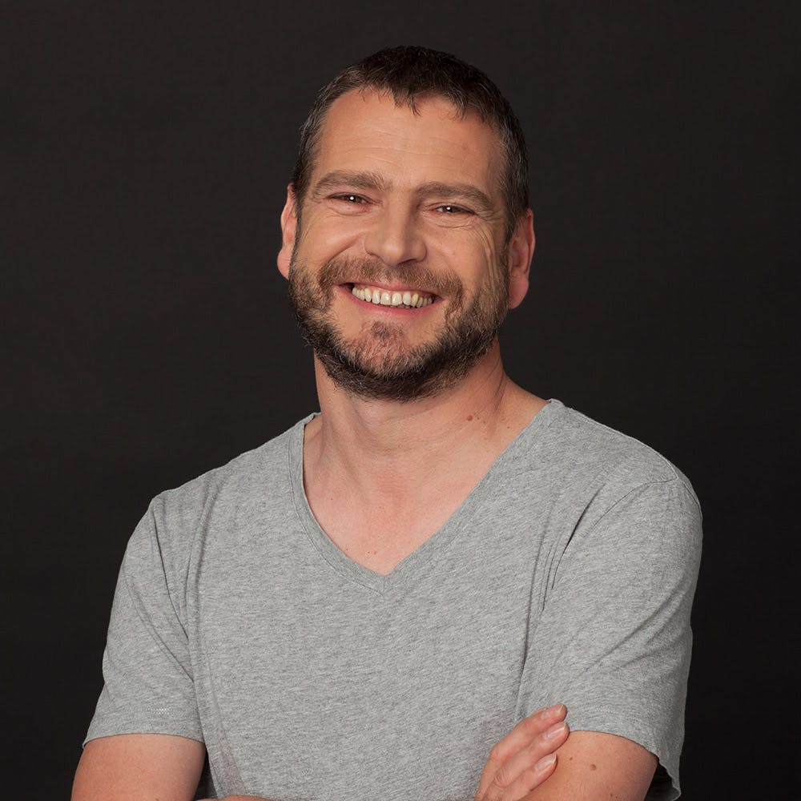
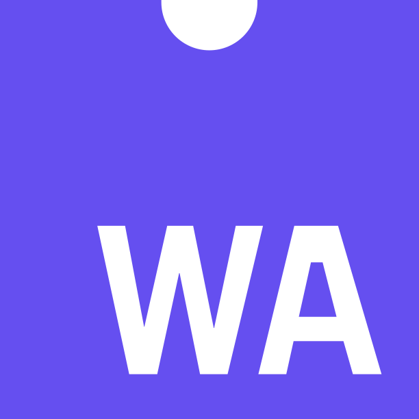
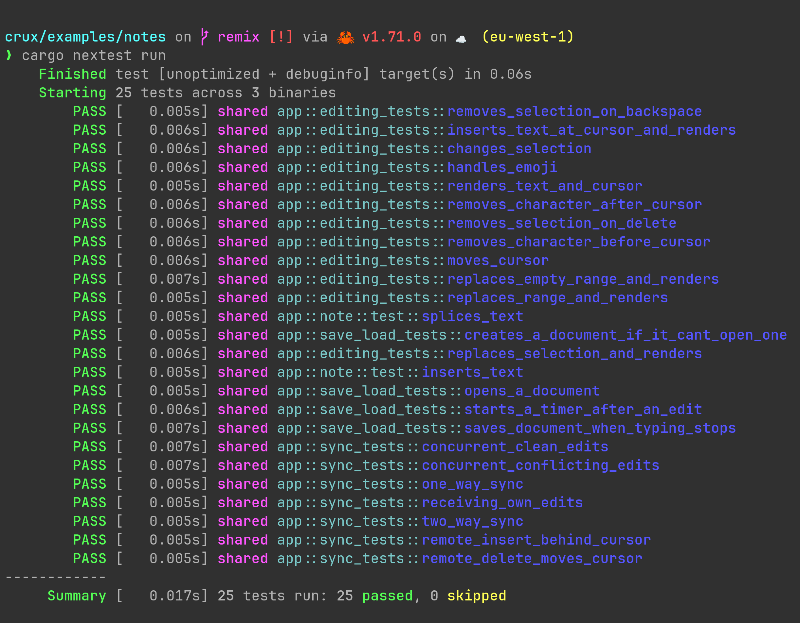

# Building iOS, Android and Web Apps that share a single Rust Core

2023-09-06

Stuart Harris

Founder & Chief Scientist

Red Badger

---

<!--
paginate: true
footer: "Rust Global @ WasmCon, Seattle 2023"
-->

 _What_ is the
problem with multi-platform app development today?

 _Rust_,
_WebAssembly_, and _Ports and Adapters_

 _Crux_ —
experimental, open source tooling for building _headless_ apps

---



# Stu

- Software engineer
- Founder of Red Badger

[@stuartharris](https://twitter.com/stuartharris)

## 

---


<span class="morph" style="--morph-name:title;">_What_ is the problem with
multi-platform app development today?</span>

 _Rust_,
_WebAssembly_, and _Ports and Adapters_

 _Crux_ —
experimental, open source tooling for building _headless_ apps

---


# <span class="morph" style="--morph-name:title;">_What_ is the problem with multi-platform app development today?</span>

<style scoped>section figure { margin-right: 100px !important; }</style>


---

#  Building a multi-platform app (don’t @ me!)

<style scoped>
table th {
    width: 16%;
}
</style>

|             | Platform Native | Kotlin MM | React Native | Capacitor Ionic | Flutter |
| ----------- | :-------------: | :-------: | :----------: | :-------------: | :-----: |
| Native UX   |       ✅        |    ✅     |     😐️      |       ❌        |   ❌    |
| Web?        |       ❌        |    😐️    |     😐️      |       ✅        |   ✅    |
| Development |       😐️       |    ✅     |     😐️      |       ✅        |   ✅    |
| Testing     |       😐️       |    😐️    |      🤯      |       🤯        |   😐️   |
| Maintenance |       😐️       |    ✅     |      😡      |       😡        |   ✅    |
| Effort      |       3x        |    2x     |      2x      |      1.5x       |  1.4x   |

---

<!--
I am sick of poor quality software — apps that just don't work well.

We can do much better.

Great tools are crucial for building great software,

and we have THE BEST tools available in Rust and WebAssembly.

And we have modern declarative UI frameworks on every platform.

The world is only just beginning to understand the power of Rust and WebAssembly.

But the architecture of our apps is also important.
"A bad workman blames his tools"

Building quality in is hard.

And it starts with being able to test our apps comprehensively and easily.
-->

#  Tooling and Architecture

## Building quality apps across all platforms is too hard

- In order to reuse code we end up _compromising_ on UX and/or DX

- UI-centric _architectures_ make applications _hard to test_ and maintain

---

#  UI-centric architecture

- UI layout is the _primary_ organising principle
- Behaviour and interaction with the outside world are _secondary_

> “It looks like this… and does that”

---

 _What_ is the
problem with multi-platform app development today?


<span class="morph" style="--morph-name:title;">_Rust_, _WebAssembly_, and
_Ports and Adapters_</span>

 _Crux_ —
experimental, open source tooling for building _headless_ apps

---


# <span class="morph" style="--morph-name:title;">_Rust_, _WebAssembly_, and _Ports and Adapters_</span>


---

<!--

We’re on the cusp of understanding how much of a revolution Rust really is.

Everyone can suddenly build rock-solid and reliable, high quality software in almost any space.

WebAssembly is our delivery mechanism. Taking Rust to the web browser.

The testing story for mobile and web apps is currently terrible.

And it will never be good until we look closely at how we architect applications.

-->

#  Better Tools and Better Architecture

- **Rust** is a _revolution_

  everyone can now build reliable, high quality software in almost any space
  — perfect for multi-platform app development

- **WebAssembly** is a _revolution_

  fast and portable — great for building apps in the languages we love

- **Ports and Adapters** is a _revolution_

  behaviour-centric architecture — leads to better testability

---

#  What if we start with behaviour?

But how do we model behaviour?

- update a _model_ in response to _events_
- emit _effects_ — intent to perform side-effects

---

<!--transition: fade 600ms-->

<div class="morph" style="--morph-name:title;">

#  Behaviour

</div>
<div class="morph" style="--morph-name:update;">
Update state when an Event is raised

```rust
fn update(event: Event, state: Model) -> Model {
  // perform HTTP request
}
```

## </div>

---

<div class="morph" style="--morph-name:title;">

#  Behaviour

</div>
<div class="morph" style="--morph-name:update;">
A pure update function (cf. Elm, Redux, etc.)

```rust
fn update(event: Event, state: Model) -> (Model, Vec<Effect>)
```

</div>
<div class="morph" style="--morph-name:http;">
A dirty function with side-effects

```rust
fn http(effect: Effect) { /* perform HTTP request */ }
```

</div>

---

<div class="morph" style="--morph-name:title;">

#  UI

</div>
<div class="morph" style="--morph-name:view;">
Imagine the UI as a projection of state (cf. early React)

```rust
fn view(state: Model) { /* update UI */ }
```

</div>

---

<div class="morph" style="--morph-name:title;">

#  UI

</div>
<div class="morph" style="--morph-name:view;">
A pure view function

```rust
fn view(state: Model) -> ViewModel
```

</div>
<div class="morph" style="--morph-name:render;">
A dirty function — UI is a side-effect

```rust
fn render(view: ViewModel) { /* update UI */ }
```

</div>

---

#  Before

_Behavior_

<div class="morph" style="--morph-name:update;">

```rust
fn update(event: Event, state: Model) -> (Model, Vec<Effect>)
```

</div>
<div class="morph" style="--morph-name:http;">

```rust
fn http(effect: Effect) { /* perform HTTP request */ }
```

</div>

_UI_

<div class="morph" style="--morph-name:view;">

```rust
fn view(state: Model) -> ViewModel
```

</div>
<div class="morph" style="--morph-name:render;">

```rust
fn render(view: ViewModel) { /* update UI */ }
```

</div>

---

<!--transition: fade 250ms-->

#  After

_Core_ (pure)

<div class="morph" style="--morph-name:update;">

```rust
fn update(event: Event, state: Model) -> (Model, Vec<Effect>)
```

</div>
<div class="morph" style="--morph-name:view;">

```rust
fn view(state: Model) -> ViewModel
```

</div>

_Shell_ (dirty)

<div class="morph" style="--morph-name:http;">

```rust
fn http(effect: Effect) { /* perform HTTP request */ }
```

</div>
<div class="morph" style="--morph-name:render;">

```rust
fn render(view: ViewModel) { /* update UI */ }
```

</div>

---

#  WebAssembly

<style scoped>section figure { margin-right: 100px !important; }</style>



WebAssembly helps us stay honest!


---

#  Behaviour-centric architecture

- Behaviour is the _primary_ organising principle
- Interaction with the outside world is _secondary_
- UI is also a side-effect

> “It does this… and looks like that!”

---

#  Ports and adapters


> Allow an application to equally be driven by users, programs, automated test
> or batch scripts, and to be developed and tested in isolation from its
> eventual run-time devices and databases.

Alistair Cockburn, 2005

[Hexagonal Architecture](https://alistair.cockburn.us/hexagonal-architecture/)

---

#  Ports and adapters


> The application can be deployed in _headless_ mode, so only the API is
> available, and other programs can make use of its functionality

Alistair Cockburn, 2005

## [Hexagonal Architecture](https://alistair.cockburn.us/hexagonal-architecture/)

---


 _What_ is the
problem with multi-platform app development today?

 _Rust_,
_WebAssembly_, and _Ports and Adapters_

 _Crux_ —
experimental, open source tooling for building _headless_ apps

---

#  Crux


- Shared _behaviour_

- in _Rust_ 

- Platform _native_ UX

<!-- ---

#  Building a multi-platform app (don’t @ me!)

<style scoped>
table th {
    width: 14%;
}
</style>

|             | Platform Native | Kotlin MM | React Native | Capacitor Ionic | Flutter | Crux |
| ----------- | :-------------: | :-------: | :----------: | :-------------: | :-----: | :--: |
| Native UX   |       ✅        |    ✅     |     😐️      |       ❌        |   ❌    |  ✅  |
| Web?        |       ❌        |    😐️    |     😐️      |       ✅        |   ✅    |  ✅  |
| Development |       😐️       |    ✅     |     😐️      |       ✅        |   ✅    |  ✅  |
| Testing     |       😐️       |    😐️    |      🤯      |       🤯        |   😐️   |  🤩  |
| Maintenance |       😐️       |    ✅     |      😡      |       😡        |   ✅    |  ✅  |
| Effort      |       3x        |    2x     |      2x      |      1.5x       |  1.4x   | 1.4x | -->

---

<!--
_footer: "Rust Global @ WasmCon<br/>Seattle 2023"
-->


---

#  _Any_ platform

| platform |  language  |      UI      | library |    lib name    |       FFI        |
| -------- | :--------: | :----------: | :-----: | :------------: | :--------------: |
| iOS      |   Swift    |   SwiftUI    | static  | `libshared.a`  | `uniffi-bindgen` |
| Android  |   Kotlin   |   Compose    | dynamic | `libshared.so` | `uniffi-bindgen` |
| Web      | TypeScript |    Remix     | _wasm_  | `shared.wasm`  |  `wasm-bindgen`  |
| Web      |    Rust    |    Leptos    |  crate  |                |                  |
| CLI      |    Rust    | `println!()` |  crate  |                |                  |

---

#  FFI

```rust
namespace shared {
  bytes process_event([ByRef] bytes msg);
  bytes handle_response([ByRef] bytes uuid, [ByRef] bytes res);
  bytes view();
};
```

Type generation with `serde-generate`

---


<style scoped>
  section figure{
    margin: 36px !important;
  }
</style>


---

<div class="morph" style="--morph-name:title;">

#  Capabilities

</div>

```rust
// fire and forget
caps.render
  .render();

// request/response
caps.http
  .post(API_URL)
  .header("Authorization", token)
  .body_json(json)
  .expect("could not serialize body")
  .expect_json()
  .send(Event::Created);

// streamed responses
caps.sse
  .get_json(API_URL, Event::Update);
```

---

<div class="morph" style="--morph-name:title;">

#  Capabilities

</div>

- Built-in (`Render`)

- `crux_*` crates (`Http`, `KeyValue`, `Platform`, `Time`)

- Custom

  - `ServerSentEvents` in the
    [Counter example](https://github.com/redbadger/crux/blob/master/examples/counter/shared/src/capabilities/sse.rs)
  - `Delay` example in the
    [book](https://redbadger.github.io/crux/guide/capability_apis.html)
  - `Timer` and `PubSub` in the
    [Notes example](https://github.com/redbadger/crux/tree/master/examples/notes/shared/src/capabilities)

- Community contributed

---

#  What does a Crux app look like?

```rust
#[derive(Default)]
pub struct App;

impl crux_core::App for App {
    type Event = Event;
    type Model = Model;
    type ViewModel = ViewModel;
    type Capabilities = Capabilities;

    fn update(&self, event: Self::Event, model: &mut Self::Model, caps: &Self::Capabilities) {
        match event {
            Event::Increment => model.count += 1,
            Event::Decrement => model.count -= 1,
            Event::Reset => model.count = 0,
        };

        caps.render.render();
    }

    fn view(&self, model: &Self::Model) -> Self::ViewModel {
        ViewModel {
            count: format!("Count is: {}", model.count),
        }
    }
}
```

---

#  What does testing look like?


---

#  What does a test look like?

```rust
#[cfg(test)]
mod test {
    use super::*;
    use crux_core::testing::AppTester;

    #[test]
    fn increments_count() {
        let app = AppTester::<App, _>::default();
        let mut model = Model::default();

        let update = app.update(Event::Increment, &mut model);

        // Check the app asked us to `Render`
        assert_effect!(update, Effect::Render(_));

        // Check view model is correct
        let actual_view = app.view(&model).count;
        let expected_view = "Count is: 1";
        assert_eq!(actual_view, expected_view);
    }
}
```

---

#  17ms

## 

---


#  The crux of Crux

- headless, multi-platform, composable apps with shared _behaviour_
- better _testability_
- higher _quality_ apps
- better _reliability_, safety, and security
- more _joy_ from better tools

---

# Thank you! 

<style scoped>section figure { margin-right: 100px !important; }</style>


[@stuartharris](https://twitter.com/stuartharris)

<br/>

[Slides](https://github.com/StuartHarris/slides/blob/main/rust_global_seattle_2023/slides.pdf)

[Crux Book](https://redbadger.github.io/crux/),
[Crux Github](https://github.com/redbadger/crux),
[Crux Docs](https://docs.rs/crux_core/latest/crux_core/),
[Crux Website](https://red-badger.com/crux)

[Rust Nation 2023 Talk](https://www.youtube.com/watch?v=cWCZms92-1g&t=5s)
