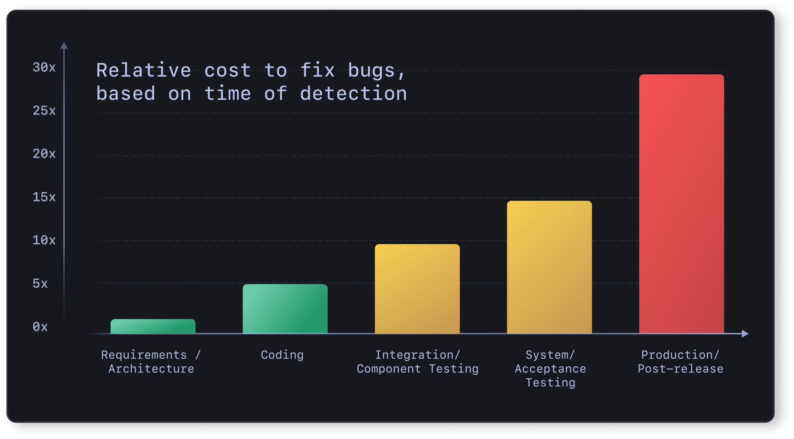

# Rust in the Enterprise

## Taking control with a modern,  sustainable approach

2023-07-20

Stuart Harris, Founder & Chief Scientist

Viktor Charypar, Technical Director

---

<!--
paginate: true
footer: "Rust in the Enterprise"
-->

# What are we talking about today?

<!-- prettier-ignore -->
* How does Rust help solve the problems that Enterprises care about?
  - What do we mean by a modern, sustainable approach?
* Where does the resistance to adopting Rust come from?
* How do we go about introducing Rust into an Enterprise?
* Beer and Pizza
* Crux overview — how Rust can help an Enterprise build high quality, sustainable software, cheaper and faster.
* Crux deep dive. Demos. Q&A.

---

# Stu

- Software engineer
- Founder of Red Badger

## 

---

# Viktor

- Software engineer
- Tech Director at Red Badger

---

# So what do enterprises care about?

- **Quality** — they want to build software that works
- **Sustainability** — they want to build software that lasts
- **Security** — they want to be secure
- **Cost/Speed** — they want it yesterday, and within budget
- **Control/Risk/Compliance** — they want to be in control of their software,
  reduce risk, and be compliant with regulations
- **Innovation/Talent/Culture** — they want to innovate, attract and retain
  talent, and build a culture of engineering excellence

---

# Quality

## Software that is _delightful_

This means:

- It does what it is supposed to do
- It is easy to use and accessible for everyone
- It is fast, reliable and secure
- It is maintainable, extensible and testable

---

# Shifting left

## Remove the long tail of bugs that are expensive to fix

> "Rust is the language where you have the hangover first!"

## 

---

# So what do enterprises care about?

- ✅ **Quality** — they want to build software that works
- **Sustainability** — they want to build software that lasts
- **Security** — they want to be secure
- **Cost/Speed** — they want it yesterday, and within budget
- **Control/Risk/Compliance** — they want to be in control of their software,
  reduce risk, and be compliant with regulations
- **Innovation/Talent/Culture** — they want to innovate, attract and retain
  talent, and build a culture of engineering excellence

---

# Sustainability

## Software that is easy to maintain and extend

This means:

- It is easy to understand
- It is easy to change
- It is easy to test
- It is easy to deploy

---

# Where does your brain power go?

> "Free up your teams to work on the most important problems"

---

# So what do enterprises care about?

- ✅ **Quality** — they want to build software that works
- ✅ **Sustainability** — they want to build software that lasts
- **Security** — they want to be secure
- **Cost/Speed** — they want it yesterday, and within budget
- **Control/Risk/Compliance** — they want to be in control of their software,
  reduce risk, and be compliant with regulations
- **Innovation/Talent/Culture** — they want to innovate, attract and retain
  talent, and build a culture of engineering excellence

---

# Security

## Software that is secure by design

This means:

- It is easy to reason about
- It is solid and reliable
- It is built on a secure foundation
- It is open

---

# So what do enterprises care about?

- ✅ **Quality** — they want to build software that works
- ✅ **Sustainability** — they want to build software that lasts
- ✅ **Security** — they want to be secure
- **Cost/Speed** — they want it yesterday, and within budget
- **Control/Risk/Compliance** — they want to be in control of their software,
  reduce risk, and be compliant with regulations
- **Innovation/Talent/Culture** — they want to innovate, attract and retain
  talent, and build a culture of engineering excellence

---

# So what do enterprises care about?

- ✅ **Quality** — they want to build software that works
- ✅ **Sustainability** — they want to build software that lasts
- ✅ **Security** — they want to be secure
- ✅ **Cost/Speed** — they want it yesterday, and within budget
- **Control/Risk/Compliance** — they want to be in control of their software,
  reduce risk, and be compliant with regulations
- **Innovation/Talent/Culture** — they want to innovate, attract and retain
  talent, and build a culture of engineering excellence

---

# So what do enterprises care about?

- ✅ **Quality** — they want to build software that works
- ✅ **Sustainability** — they want to build software that lasts
- ✅ **Security** — they want to be secure
- ✅ **Cost/Speed** — they want it yesterday, and within budget
- ✅ **Control/Risk/Compliance** — they want to be in control of their software,
  reduce risk, and be compliant with regulations
- **Innovation/Talent/Culture** — they want to innovate, attract and retain
  talent, and build a culture of engineering excellence

---

# So what do enterprises care about?

- ✅ **Quality** — they want to build software that works
- ✅ **Sustainability** — they want to build software that lasts
- ✅ **Security** — they want to be secure
- ✅ **Cost/Speed** — they want it yesterday, and within budget
- ✅ **Control/Risk/Compliance** — they want to be in control of their software,
  reduce risk, and be compliant with regulations
- ✅ **Innovation/Talent/Culture** — they want to innovate, attract and retain
  talent, and build a culture of engineering excellence

---

# Where does the resistance come from?

- **Risk** — "We don't want to be the first to do this"
- **Cost** — "We don't have the budget"
- **Speed** — "We don't have the time"
- **Culture** — "We don't have the talent"

---

# Pincer movement!

- **Top down** — "We need to do this"
- **Bottom up** — "We want to do this"

---

# How do we get there?

## Top down

- Find the open source owner (OSPO)
- Find a champion (and a project goal)
  - Might not be a technology champion
  - Would be great to have a product sponsor
- Run a 2-horse race

---

# Skunk Works

<!-- prettier-ignore -->
> a group within an organization given a high degree of autonomy and unhampered by bureaucracy, with the task of working on advanced or secret projects

---

> “We don’t want to be first, but we can’t be third!”

But if you’re not starting now, you’ll already be behind when it matters

---

# How do we get there?

## Bottom up

- Learn it yourself
- Write some tools
- Start small and stay small
- Build a mini community, hold meetups
- Infect your organisation

> Think of a petri dish — a culture pops up in a few places and then eventually
> it’s everywhere

---

# Finally...

> Don't “Rewrite it in Rust”™!

Rust was born at Mozilla in 2009...

...but in 2023, Firefox is still less than 10% Rust

---

# Let's have a break!

