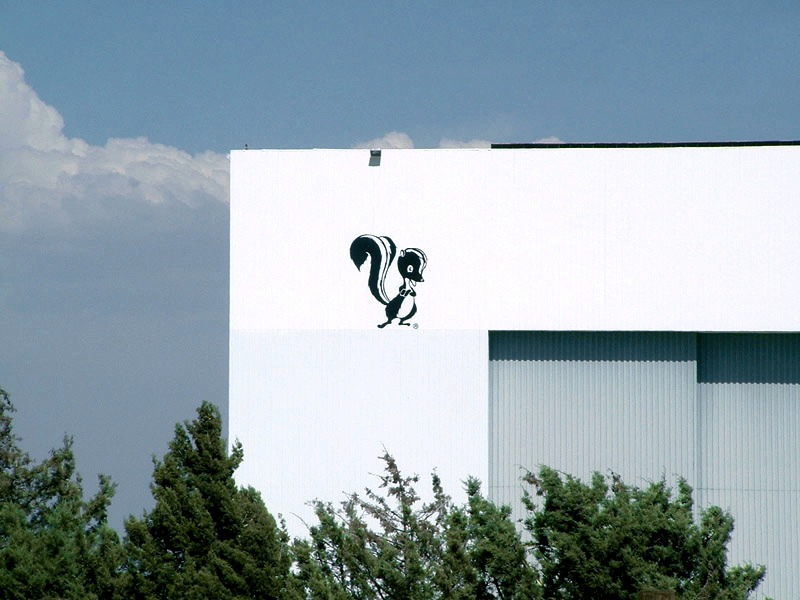
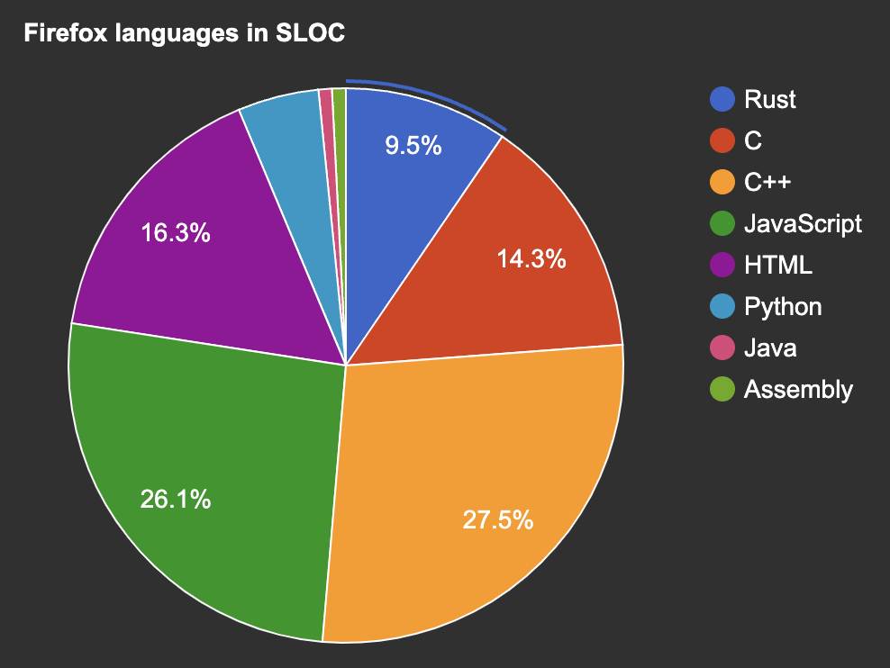

# Rust in the Enterprise

## Taking control with a modern,   sustainable approach   to software engineering

2023-07-20

Stuart Harris, Founder & Chief Scientist

Viktor Charypar, Technical Director

---

<!--
paginate: true
footer: "Rust in the Enterprise"
-->

# What are we talking about today?

<!-- prettier-ignore -->
* How does Rust help solve the problems that Enterprises care about?
  - What do we mean by a modern, sustainable approach?
* Where does the resistance to adopting Rust come from?
* How do we go about introducing Rust into an Enterprise?
* Beer and Pizza
* Crux overview
  - How Rust can help an Enterprise build high quality, sustainable digital product, cheaper and faster.
* Crux deep dive. Demos. Q&A.

---

# Stu

- Software engineer
- Founder of Red Badger

## 

---

# Viktor

- Software engineer
- Tech Director at Red Badger

---

# What do enterprises care about?

- **Quality** — they want to build software that works
- **Sustainability** — they want to build software that lasts
- **Security** — they want to be secure
- **Cost/Speed** — they want it yesterday, and within budget
- **Control/Risk/Compliance** — they want to be in control of their software,
  reduce risk, and be compliant with regulations
- **Innovation/Talent/Culture** — they want to innovate, attract and retain
  talent, and build a culture of engineering excellence

---

# What do enterprises care about?

- ➡️ **Quality** — they want to build software that works
- **Sustainability** — they want to build software that lasts
- **Security** — they want to be secure
- **Cost/Speed** — they want it yesterday, and within budget
- **Control/Risk/Compliance** — they want to be in control of their software,
  reduce risk, and be compliant with regulations
- **Innovation/Talent/Culture** — they want to innovate, attract and retain
  talent, and build a culture of engineering excellence

---

# Quality

## Software that is _delightful_

This means:

- It is well designed (from a UX perspective)
- It does what it is supposed to do
- It is easy to use and accessible for everyone
- It is fast, reliable and secure
- It is maintainable, extensible and testable

---

# Shifting left

## Remove the long tail of bugs that are expensive to fix

> "Rust is the language where you have the hangover first!"

## 

https://deepsource.com/blog/exponential-cost-of-fixing-bugs

---

# So what do enterprises care about?

- ✅ **Quality** — they want to build software that works
- ➡️ **Sustainability** — they want to build software that lasts
- **Security** — they want to be secure
- **Cost/Speed** — they want it yesterday, and within budget
- **Control/Risk/Compliance** — they want to be in control of their software,
  reduce risk, and be compliant with regulations
- **Innovation/Talent/Culture** — they want to innovate, attract and retain
  talent, and build a culture of engineering excellence

---

# Sustainability

## Software that is easy to maintain and extend

This means:

- It is easy to understand
- It is easy to test
- It is easy to deploy
- It is easy to change

<!-- easy to "not touch" for months -->

---

# Where does your brain power go?

<!-- prettier-ignore -->
> "Free up your teams to work on the most important problems — those that are _unique_ to your business"

- Rust's guardrails prevent us wasting time on bugs
- Rust's toolchain is the best there is
  - removes bike-shedding
  - reduces yak-shaving
- A large codebase won't descend into chaos
- "It just works"™
  - no long tail — means you can leave it alone

---

# Sustainable Software Engineering

<!-- prettier-ignore -->
> "Everyone has a part to play."
> "Sustainability is enough, all by itself, to justify our work."

- Find as many "Carbon Proxies" as you can, e.g.
  - Time-to-interactive and Page weight
  - Average server response time
  - Cost of your services
  - The utilisation of your servers

[sustainability with rust](https://aws.amazon.com/blogs/opensource/sustainability-with-rust/)
[sustainable software engineering overview](https://learn.microsoft.com/en-gb/training/modules/sustainable-software-engineering-overview)
[how to measure and reduce the carbon footprint of your application](https://www.microsoft.com/en-gb/industry/blog/technetuk/2021/10/12/how-to-measure-and-reduce-the-carbon-footprint-of-your-application/)

---

# So what do enterprises care about?

- ✅ **Quality** — they want to build software that works
- ✅ **Sustainability** — they want to build software that lasts
- ➡️ **Security** — they want to be secure
- **Cost/Speed** — they want it yesterday, and within budget
- **Control/Risk/Compliance** — they want to be in control of their software,
  reduce risk, and be compliant with regulations
- **Innovation/Talent/Culture** — they want to innovate, attract and retain
  talent, and build a culture of engineering excellence

---

# Security

## Software that is secure by design

This means:

- It is easy to reason about
- It is solid and reliable
- It is built on a secure foundation
- It is open

---

# So what do enterprises care about?

- ✅ **Quality** — they want to build software that works
- ✅ **Sustainability** — they want to build software that lasts
- ✅ **Security** — they want to be secure
- ➡️ **Cost/Speed** — they want it yesterday, and within budget
- **Control/Risk/Compliance** — they want to be in control of their software,
  reduce risk, and be compliant with regulations
- **Innovation/Talent/Culture** — they want to innovate, attract and retain
  talent, and build a culture of engineering excellence

---

# Cost/Speed

> "Rust will speed up your development and reduce your costs"

### 5 Rumours about Rust

1. Rust takes more than 6 months to learn – Debunked! 😇
2. The Rust compiler is not as fast as people would like – Confirmed! 😅
3. Unsafe code and interop are always the biggest challenges – Debunked! 😌
4. Rust has amazing compiler error messages – Confirmed! 😍
5. Rust code is high quality – Confirmed! 🤩

from over 1,000 Google developers

https://opensource.googleblog.com/2023/06/rust-fact-vs-fiction-5-insights-from-googles-rust-journey-2022.html

---

---

# So what do enterprises care about?

- ✅ **Quality** — they want to build software that works
- ✅ **Sustainability** — they want to build software that lasts
- ✅ **Security** — they want to be secure
- ✅ **Cost/Speed** — they want it yesterday, and within budget
- ➡️ **Control/Risk/Compliance** — they want to be in control of their software,
  reduce risk, and be compliant with regulations
- **Innovation/Talent/Culture** — they want to innovate, attract and retain
  talent, and build a culture of engineering excellence

---

# Control/Risk/Compliance

- Rust is a trusted, open source language
- you can write software that is
  - memory safe
  - safe from data races and concurrency bugs
  - easy to test
  - easy to audit and maintain
- a great fit for regulated industries

<!-- control - easier to be verifiably correct, no need for SonarCube and other similar tools-->

---

# So what do enterprises care about?

- ✅ **Quality** — they want to build software that works
- ✅ **Sustainability** — they want to build software that lasts
- ✅ **Security** — they want to be secure
- ✅ **Cost/Speed** — they want it yesterday, and within budget
- ✅ **Control/Risk/Compliance** — they want to be in control of their software,
  reduce risk, and be compliant with regulations
- ➡️ **Innovation/Talent/Culture** — they want to innovate, attract and retain
  talent, and build a culture of engineering excellence

---

# Innovation/Talent/Culture

<!-- prettier-ignore -->
> "Managers need to know that their hard-won employees are gainfully employed and are not frustrated, bored, or flight risks"

- attract and retain talent — become a "destination"
- build a culture of engineering excellence
- Rust helps you become a better software engineer
- "Most loved/desired" on Stack Overflow for 8 years in a row

---

# So what do enterprises care about?

- ✅ **Quality** — they want to build software that works
- ✅ **Sustainability** — they want to build software that lasts
- ✅ **Security** — they want to be secure
- ✅ **Cost/Speed** — they want it yesterday, and within budget
- ✅ **Control/Risk/Compliance** — they want to be in control of their software,
  reduce risk, and be compliant with regulations
- ✅ **Innovation/Talent/Culture** — they want to innovate, attract and retain
  talent, and build a culture of engineering excellence

---

# Where does the resistance come from?

- **Risk** — "We don't want to be the first to do this"
- **Cost** — "We don't have the budget"
- **Speed** — "We don't have the time"
- **Culture** — "We don't have the talent"

> This is all FEAR talking — FUD!

---

# Pincer movement!

- **Top down** — "We need to do this"
- **Bottom up** — "We want to do this"

---

# How do we get there?

## Top down

- Talk to the CIO. Find a buddy to help you
- Find the open source owner (OSPO)
- Find a champion (and a project goal)
  - Might not be a technology champion
  - Would be great to have a product sponsor
- Run a 2-horse race

---

# Skunk Works

<!-- prettier-ignore -->
> a group within an organization given a high degree of autonomy and unhampered by bureaucracy, with the task of working on advanced or secret projects

---

> “We don’t want to be first, but we can’t be third!”

But if you’re not starting now, you’ll already be behind when it matters

---

# How do we get there?

## Bottom up

- Learn it yourself
- Write some tools
- Start small and stay small
- Build a mini community, hold meetups
- Infect your organisation

> Think of a petri dish — a culture pops up in a few places and then eventually
> it’s everywhere

---

# Also...

> Don't “Rewrite it in Rust”™!

Rust was born at Mozilla in 2009...

...but in 2023, Firefox is still less than 10% Rust

---

# And finally...

## Rust and WebAssembly

- Rust and Wasm are a perfect match
- Wasm is becoming a game-changer for cloud native
- The sandboxed execution environment is a great fit for enterprise

---

# Something to think about...

## Rust and Copilot

<!-- prettier-ignore -->
> Despite being risk averse, enterprises need the productivity gains of AI coding assistants...

<!-- prettier-ignore -->
> ...thank goodness the Rust compiler is strict and precise!

---

# Let's have a break!

---

# Let's talk Crux!

<!-- prettier-ignore -->
> Crux is a great example of how Rust can help the enterprise build better quality software with less effort (cost) and more Joy™

---

# But first...

---

# Or 17ms...

---

---

# iOS, Android and Web apps in Rust

## a.k.a. Headless apps

17.feb.2023

Stuart Harris

Founder & Chief Scientist, Red Badger

---

---

# Building a multi-platform app (don’t @ me!)

|             | Platform Native | Kotlin MM | React Native | Capacitor Ionic | Flutter | Crux |
| ----------- | :-------------: | :-------: | :----------: | :-------------: | :-----: | :--: |
| Native UX   |       ✅        |    ✅     |     😐️      |       ❌        |   ❌    |  ✅  |
| Web?        |       ❌        |    😐️    |     😐️      |       ✅        |   ✅    |  ✅  |
| Development |       😐️       |    ✅     |     😐️      |       ✅        |   ✅    |  ✅  |
| Testing     |       😐️       |    😐️    |      🤯      |       🤯        |   😐️   |  🤩  |
| Maintenance |       😐️       |    ✅     |      😡      |       😡        |   ✅    |  ✅  |
| Effort      |       3x        |    2x     |      2x      |      1.5x       |  1.4x   | 1.4x |

---

---

# Deep dive into Crux

---

# Thank you!

---

# Why Rust?

- https://aws.amazon.com/blogs/opensource/sustainability-with-rust/
- https://www.wired.com/story/rust-secure-programming-language-memory-safe/
- https://content.red-badger.com/resources/how-to-use-rust-to-build-networked-services
- https://www.technologyreview.com/2023/02/14/1067869/rust-worlds-fastest-growing-programming-language
- https://www.techspot.com/news/97654-how-broken-elevator-led-one-most-loved-programming.html

---

# Rust adoption in the enterprise

- https://www.infoq.com/presentations/rust-adoption-journey/
- https://rustmagazine.org/issue-1/2022-review-the-adoption-of-rust-in-business/
- https://vercel.com/blog/turborepo-migration-go-rust
- https://opensource.googleblog.com/2023/06/rust-fact-vs-fiction-5-insights-from-googles-rust-journey-2022.html
- https://www.infoq.com/articles/rust-ecosystem-review-2023

---

# Crux

- https://github.com/redbadger/crux
- https://redbadger.github.io/crux/
- https://red-badger.com/crux
- https://docs.rs/crux_core/latest/crux_core/
- https://www.youtube.com/watch?v=cWCZms92-1g&t=5s
