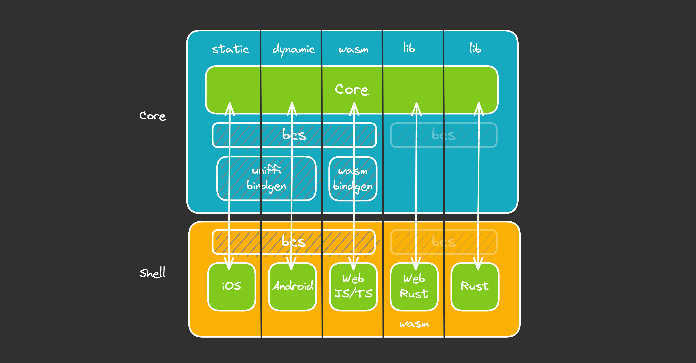

# Headless apps
18.feb.2023

<br/>
<br/>
Stuart Harris,

Founder & Chief Scientist

Red Badger

---
<!--
paginate: true
footer: "Headless Apps — Rust Nation 2023"
-->
<style scoped>
  section figure{
    margin-right: 40px !important;
  }
</style>

# What are headless apps?

* Share _behaviour_ across platforms
* Pure Core (push side effects to the edge)
* Strict contract between Core and Shell
* Acknowledge that platforms are best at UI ...
  * ... and that UI is a side effect
* Ports & Adapters (Hexagonal, Clean, Onion Architecture)
* All about _testability_

<!-- As a consultancy, unique perspective -->

---
# Motivation


* JavaScript is a mess!
  Layer on top of layer.
  On top of sand.
* There is no known implementation of Ports and Adapters in this space
* Shift left on app quality
* Testing apps shouldn't be hard
* Don't do it twice. Or even 3 times.

https://redbadger.github.io/crux/motivation.html

---

# Platform Native


- Platform-native UX
- Nothing is shared (but full control)
- Siloed teams (Swift, Kotlin)
- Twice the cost?
- Web?

https://developer.apple.com/xcode/swiftui/
https://developer.android.com/jetpack/compose

---
# Kotlin Multi-platform Mobile

- Platform-native UX
- Shared logic
- Access to native APIs
- Teams do Kotlin (and Swift)

https://kotlinlang.org/lp/mobile/

---
# React Native

- Good UX (sometimes need to dig in)
- Shared logic
- Teams do TypeScript (but native needed)
- Maintenance can be problematic

https://reactnative.dev/

---
# Flutter

- Full stack (UX/UI not native)
- Everything shared
- Plugins
- Teams do Dart

https://flutter.dev/

---
# Capacitor / Ionic

- Hybrid (any Web stack)
- Access to native APIs
- Plugins
- Teams do TypeScript

https://capacitorjs.com/
https://ionicframework.com/

---
# Crux

- Platform-native UX
- Shared _behaviour_
- Capabilities
- Teams do Rust &nbsp; 
- (and Swift, Kotlin, TypeScript)

https://redbadger.github.io/crux

---
# Building a multi-platform app (don’t @ me!)

<style scoped>
table th {
    width: 14%;
}
</style>

|             | Platform Native | Kotlin MM | React Native | Capacitor Ionic | Flutter | Crux  |
| ----------- | :-------------: | :-------: | :----------: | :-------------: | :-----: | :---: |
| Native UX   |        ✅        |     ✅     |      😐️       |        ❌        |    ❌    |   ✅   |
| Web?        |        ❌        |     😐️     |      😐️       |        ✅        |    ✅    |   ✅   |
| Development |        😐️        |     ✅     |      😐️       |        ✅        |    ✅    |   ✅   |
| Testing     |        😐️        |     😐️     |      🤯       |        🤯        |    😐️    |   🤩   |
| Maintenance |        😐️        |     ✅     |      😡       |        😡        |    ✅    |   ✅   |
| Effort      |       3x        |    2x     |      2x      |      1.5x       |  1.4x   | 1.4x  |

---
# Who benefits?

<style scoped>
table th {
    width: 14%;
}
</style>


---
# Ports and adapters


> Allow an application to equally be driven by users, programs, automated test or batch scripts, and to be developed and tested in isolation from its eventual run-time devices and databases.

Alistair Cockburn, [“Hexagonal architecture“](https://alistair.cockburn.us/hexagonal-architecture/), 2005

---
# Ports and adapters


> The application can be deployed in ‘’headless’’ mode, so only the API is available, and other programs can make use of its functionality

Alistair Cockburn, [“Hexagonal architecture“](https://alistair.cockburn.us/hexagonal-architecture/), 2005

---
# Onion architecture


<style scoped>
  a { font-size: 24px; position: absolute;}
</style>
https://github.com/stuartharris/onion

---


---
# _Any_ client

|          |       iOS        |      Android       |  Web  |      Web       |  CLI  |
| -------- | :--------------: | :----------------: | :---: | :------------: | :---: |
| language |    Swift/ObjC    |    Kotlin/Java     | Rust  |     JS/TS      | Rust  |
| UI       |  SwiftUI/UIKit   | Compose/View-based |  Yew  | Next.js/React  |   -   |
| library  |      static      |   dynamic (JNA)    | crate |      wasm      | crate |
| lib name |  `libshared.a`   |   `libshared.so`   |   -   | `shared.wasm`  |   -   |
| FFI      | `uniffi-bindgen` |  `uniffi-bindgen`  |   -   | `wasm-bindgen` |   -   |

---


---


---
# The crux of Crux

* experimental, but usable today
* infrastructure for headless, multi-platform apps with shared behaviour
* for better testability
* for higher code and behaviour reuse
* for better safety and security
* and more joy from better tools

---
# What does a Crux app look like?

```rust
#[derive(Default)]
pub struct Hello;

impl App for Hello {
    type Event = Event;
    type Model = Model;
    type ViewModel = ViewModel;
    type Capabilities = Capabilities;

    fn update(&self, event: Self::Event, model: &mut Self::Model, caps: &Self::Capabilities) {
        match event {
            Event::Increment => model.count += 1,
            Event::Decrement => model.count -= 1,
            Event::Reset => model.count = 0,
        };

        caps.render.render();
    }

    fn view(&self, model: &Self::Model) -> Self::ViewModel {
        ViewModel {
            count: format!("Count is: {}", model.count),
        }
    }
}
```
---
# What does a test look like?

```rust
#[cfg(test)]
mod test {
    use super::*;
    use crux_core::{render::RenderOperation, testing::AppTester};

    #[test]
    fn increments_count() {
        let app = AppTester::<Hello, _>::default();
        let mut model = Model::default();

        let update = app.update(Event::Increment, &mut model);

        // Check view model is correct
        let actual_view = app.view(&model).count;
        let expected_view = "Count is: 1";
        assert_eq!(actual_view, expected_view);

        // Check update asked us to `Render`
        let actual_effect = &update.effects[0];
        let expected_effect = &Effect::Render(RenderOperation);
        assert_eq!(actual_effect, expected_effect);
    }
}
```
---
# Capabilities
  * Fire and forget
  `caps.render.render();`
  * Request/response
  `caps.http.get(API_URL).expect_json().send(Event::Set);`
  * Streaming
  `caps.sse.get_json(API_URL, Event::Update);`

---

# Demo
## Headless app development in Rust
