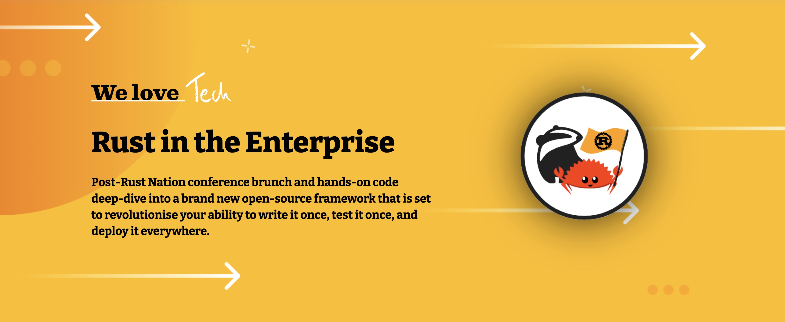

# iOS, Android and Web apps in Rust

## a.k.a. Headless apps

17.feb.2023

Stuart Harris

Founder & Chief Scientist, Red Badger

---

<!--
paginate: true
footer: "Headless Apps — Rust Nation 2023"
-->

# What are we talking about today?

<!-- prettier-ignore -->
* What do we mean by "Headless apps"?
* What does the landscape look like?
* How can we improve on this?
* Introduce Crux, a new open source "library" for building headless apps.

---


# Hi, I'm Stu

- Founder of Red Badger
- Software engineer

<br />
<br />


---

<style scoped>
  section figure{
    margin-right: 40px !important;
  }
</style>

# What are headless apps?


<!-- prettier-ignore -->
* Share _behaviour_ across platforms
* Pure Core (push side effects to the edge)
* Strict contract between Core and Shell
* Acknowledge that platforms are best at UI ...
  * ... and that UI is a side effect
* All about _testability_
* Ports & Adapters (Hexagonal, Clean, Onion Architecture)

<!-- As a consultancy, unique perspective -->

---

# Motivation


<!-- prettier-ignore -->
* JavaScript is a mess!
  Layer on top of layer.
  On top of sand.
* There is no known implementation of Ports and Adapters in this space
* Shift left on app quality
* Testing apps shouldn't be hard
* Don't do it twice. Or even 3 times.

https://redbadger.github.io/crux/motivation.html

---

# Platform Native


- Platform-native UX
- Nothing is shared (but full control)
- Siloed teams (Swift, Kotlin)
- Twice the cost?
- Web?

https://developer.apple.com/xcode/swiftui/
https://developer.android.com/jetpack/compose

---

# React Native


- Good UX (sometimes need to dig in)
- Shared logic
- Teams do TypeScript (but native needed)
- Maintenance can be problematic

https://reactnative.dev/

---

# Flutter


- Full stack (UX/UI not native, but Cupertino/Material flavours)
- Everything shared
- Plugins
- Teams do Dart

https://flutter.dev/

---

# Kotlin Multi-platform Mobile


- Platform-native UX
- Shared logic
- Access to native APIs
- Teams do Kotlin (and Swift)

https://kotlinlang.org/lp/mobile/

---

# Capacitor / Ionic


- Hybrid (any Web stack)
- Access to native APIs
- Plugins
- Teams do TypeScript

https://capacitorjs.com/

https://ionicframework.com/

One to watch: https://tauri.app/blog/2022/12/09/tauri-mobile-alpha/

---

# Building a multi-platform app (don’t @ me!)

<style scoped>
table th {
    width: 14%;
}
</style>

|             | Platform Native | Kotlin MM | React Native | Capacitor Ionic | Flutter |
| ----------- | :-------------: | :-------: | :----------: | :-------------: | :-----: |
| Native UX   |       ✅        |    ✅     |     😐️      |       ❌        |   ❌    |
| Web?        |       ❌        |    😐️    |     😐️      |       ✅        |   ✅    |
| Development |       😐️       |    ✅     |     😐️      |       ✅        |   ✅    |
| Testing     |       😐️       |    😐️    |      🤯      |       🤯        |   😐️   |
| Maintenance |       😐️       |    ✅     |      😡      |       😡        |   ✅    |
| Effort      |       3x        |    2x     |      2x      |      1.5x       |  1.4x   |

---

 

---

# Crux


- Platform-native UX
- Shared _behaviour_
- Capabilities
- Teams do Rust &nbsp; 
- (and Swift, Kotlin, TypeScript)

https://redbadger.github.io/crux

---

# Building a multi-platform app (don’t @ me!)

<style scoped>
table th {
    width: 14%;
}
</style>

|             | Platform Native | Kotlin MM | React Native | Capacitor Ionic | Flutter | Crux |
| ----------- | :-------------: | :-------: | :----------: | :-------------: | :-----: | :--: |
| Native UX   |       ✅        |    ✅     |     😐️      |       ❌        |   ❌    |  ✅  |
| Web?        |       ❌        |    😐️    |     😐️      |       ✅        |   ✅    |  ✅  |
| Development |       😐️       |    ✅     |     😐️      |       ✅        |   ✅    |  ✅  |
| Testing     |       😐️       |    😐️    |      🤯      |       🤯        |   😐️   |  🤩  |
| Maintenance |       😐️       |    ✅     |      😡      |       😡        |   ✅    |  ✅  |
| Effort      |       3x        |    2x     |      2x      |      1.5x       |  1.4x   | 1.4x |

---

# Who benefits?

<style scoped>
table th {
    width: 14%;
}
</style>


---

# Ports and adapters


> Allow an application to equally be driven by users, programs, automated test
> or batch scripts, and to be developed and tested in isolation from its
> eventual run-time devices and databases.

Alistair Cockburn,
[“Hexagonal architecture“](https://alistair.cockburn.us/hexagonal-architecture/),
2005

---

# Ports and adapters


> The application can be deployed in ‘’headless’’ mode, so only the API is
> available, and other programs can make use of its functionality

Alistair Cockburn,
[“Hexagonal architecture“](https://alistair.cockburn.us/hexagonal-architecture/),
2005

---

# _Any_ client

|          |       iOS        |      Android       |      Web       |  Web  |  CLI  |
| -------- | :--------------: | :----------------: | :------------: | :---: | :---: |
| language |    Swift/ObjC    |    Kotlin/Java     |     JS/TS      | Rust  | Rust  |
| UI       |  SwiftUI/UIKit   | Compose/View-based | Next.js/React  |  Yew  |   -   |
| library  |      static      |   dynamic (JNA)    |      wasm      | crate | crate |
| lib name |  `libshared.a`   |   `libshared.so`   | `shared.wasm`  |   -   |   -   |
| FFI      | `uniffi-bindgen` |  `uniffi-bindgen`  | `wasm-bindgen` |   -   |   -   |

Type generation with `serde-generate`

---

<style scoped>
  section figure{
    margin: 40px !important;
  }
</style>


---

<style scoped>
  section figure{
    margin: 36px !important;
  }
</style>


---

# Capabilities

<!-- prettier-ignore -->
* Fire and forget
`caps.render.render();`
<!-- prettier-ignore -->
* Request/response
`caps.http.get(API_URL).expect_json().send(Event::Set);`
<!-- prettier-ignore -->
* Streaming
`caps.sse.get_json(API_URL, Event::Update);`

---

# Capabilities

- Built-in (`Render`)

- `crux_*` crates (`Http`, `KeyValue`, `Platform`, `Time`)

- Custom

  - `ServerSentEvents` in the
    [Counter example](https://github.com/redbadger/crux/blob/master/examples/counter/shared/src/capabilities/sse.rs)
  - `Delay` example in the
    [book](https://redbadger.github.io/crux/guide/capability_apis.html)
  - `Timer` and `PubSub` in the
    [Notes example](https://github.com/redbadger/crux/tree/master/examples/notes/shared/src/capabilities)

- Community contributed

---

# What does a Crux app look like?

```rust
#[derive(Default)]
pub struct Hello;

impl App for Hello {
    type Event = Event;
    type Model = Model;
    type ViewModel = ViewModel;
    type Capabilities = Capabilities;

    fn update(&self, event: Self::Event, model: &mut Self::Model, caps: &Self::Capabilities) {
        match event {
            Event::Increment => model.count += 1,
            Event::Decrement => model.count -= 1,
            Event::Reset => model.count = 0,
        };

        caps.render.render();
    }

    fn view(&self, model: &Self::Model) -> Self::ViewModel {
        ViewModel {
            count: format!("Count is: {}", model.count),
        }
    }
}
```

---

# What does a test look like?

```rust
#[cfg(test)]
mod test {
    use super::*;
    use crux_core::{render::RenderOperation, testing::AppTester};

    #[test]
    fn increments_count() {
        let app = AppTester::<Hello, _>::default();
        let mut model = Model::default();

        let update = app.update(Event::Increment, &mut model);

        // Check the app asked us to `Render`
        let actual_effect = &update.effects[0];
        let expected_effect = &Effect::Render(RenderOperation);
        assert_eq!(actual_effect, expected_effect);

        // Check view model is correct
        let actual_view = app.view(&model).count;
        let expected_view = "Count is: 1";
        assert_eq!(actual_view, expected_view);
    }
}
```

---


# Demo

## Headless app development in Rust

---

# The crux of Crux

<!-- prettier-ignore -->
* a lightweight runtime
  * for headless, multi-platform, composable apps with shared behaviour
  * for better testability
  * for higher code and behaviour reuse
  * for better safety and security
  * and more *joy* from better tools

---

# What's next?

<!-- prettier-ignore -->
* Build a community
* Build some big apps
* Improve ergonomics and DX — docs, [book](https://redbadger.github.io/crux), sharp edges, testing
* Crux Doctor
* Evolve capabilities (and add shell-side code)
* You tell us?

---

# Summary

<!-- prettier-ignore -->
* Headless apps share behaviour across platforms
* That behaviour can be easily and exhaustively tested
* Test feedback is very fast, allowing you to be more productive
* Crux can get you moving quickly

---

<!--
_footer: https://content.red-badger.com/events/rust-in-the-enterprise
-->



---

# Big thanks to

- Viktor Charypar https://twitter.com/charypar
- Graeme Coupar https://twitter.com/obmarg

---

<style scoped>
  section figure{
    margin-right: 40px !important;
  }
</style>


# Thank you!

- Stuart Harris https://twitter.com/stuartharris

- Github https://github.com/redbadger/crux

- Book https://redbadger.github.io/crux

- Event tomorrow https://content.red-badger.com/events/rust-in-the-enterprise
